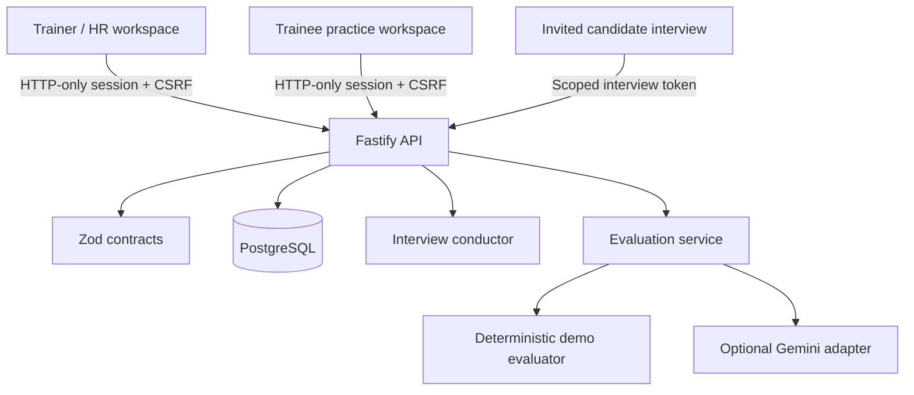

# Architecture

## Principles

1. The API owns authentication, authorization, persistence and AI-provider access.
2. Every organization-scoped query includes `organization_id`; object identifiers alone never grant access.
3. Shared Zod contracts validate untrusted input at runtime and provide types to both applications.
4. Signed-in users and invited candidates use separate credentials with different scopes and lifetimes.
5. Evaluation produces reviewable evidence, while a separate human action records the pipeline decision.
6. Demo mode implements the same store interface as PostgreSQL so the UI does not contain fake data branches.

## Runtime flow

The web app never connects directly to PostgreSQL and never receives provider secrets. Registration creates an organization and its first user atomically. A Trainer receives an organization-scoped HR workspace; a Trainee receives a separate practice workspace and cannot access Trainer routes. Before starting, the browser creates the session's high-entropy resume capability so a repeated start or resume request is safe even when a response is lost. The database stores invitation and resume-token digests instead of raw capabilities, with explicit expiry, revocation, consumption, and resume windows. Candidate access tokens are valid only for one session; the resume capability can issue a fresh access token while interview completion is still awaiting a durable report. Trainer decisions are persisted after the AI report and can be audited independently.

## Domain model

- Organization owns users, roles and interview sessions. Trainee accounts receive an isolated personal workspace.
- Role stores the agreed questions and competencies used across candidates.
- Interview session connects one invitation, one candidate and one role, including the invitation/resume lifecycle and evaluation-start timestamp.
- Answer is unique per session and question, carries a monotonic revision, and may include one server-generated follow-up and response.
- Report stores the structured assessment, availability state, and its source answers.
- Audit event records sensitive Trainer actions with request identifiers.

## Database release model

`infra/postgres` contains append-only SQL migrations. The API migration runner verifies the compiled filename/checksum manifest, serializes runners with a PostgreSQL advisory lock, and records applied versions in `cybervett_schema_migrations`. Fresh databases and compatible legacy databases follow the same forward path; application readiness requires the release's expected ledger version.

The container topology keeps PostgreSQL and the API on a private network. Nginx is the same-origin boundary for browser `/api` requests. The included Vercel project is intentionally frontend-only and returns an explicit API-unavailable response.

## Extension points

- Add a language in `apps/web/src/context/LocaleContext.tsx` and include it in the `Locale` union.
- Add an evaluator by implementing the `Evaluator` interface.
- Add an interview model by implementing the `InterviewConductor` interface.
- Add a database provider by implementing the `Store` interface.
- Add roles or permissions at the route boundary and keep organization filters in the store.

## Recommended next infrastructure work

- Managed PostgreSQL with point-in-time recovery and encrypted backups.
- Transactional email for invitations and status notifications.
- OpenTelemetry traces, centralized structured logs, uptime checks and alerting.
- A background queue for provider calls, retries and retention/deletion jobs.
- SSO, MFA and user lifecycle management for enterprise organizations.
